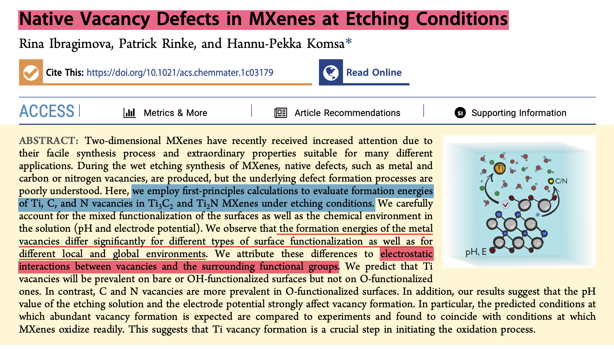

<Boxx/>

## Overview

Overview: this article mainly investigate the influence of functional gorup on the formation of vacancy(Ti and C element).

<!-- more -->

## Method
Method: Pourbaix diagram; the defect formation energy is defined as 

## Results
The bare surface present the lowest formation energy. But in the real condition, the surface of MXene will be terminated with function in the aqueous solution. According to the graph above, the formation energy of vacanvy decreases with the increasing ratio of -OH.

<Reward/>
